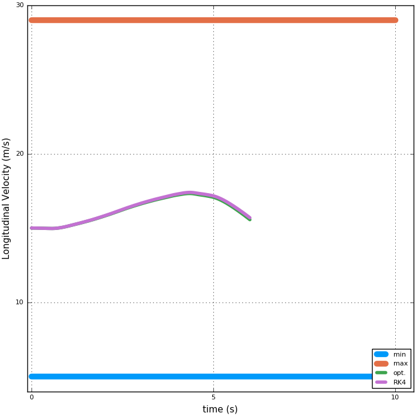
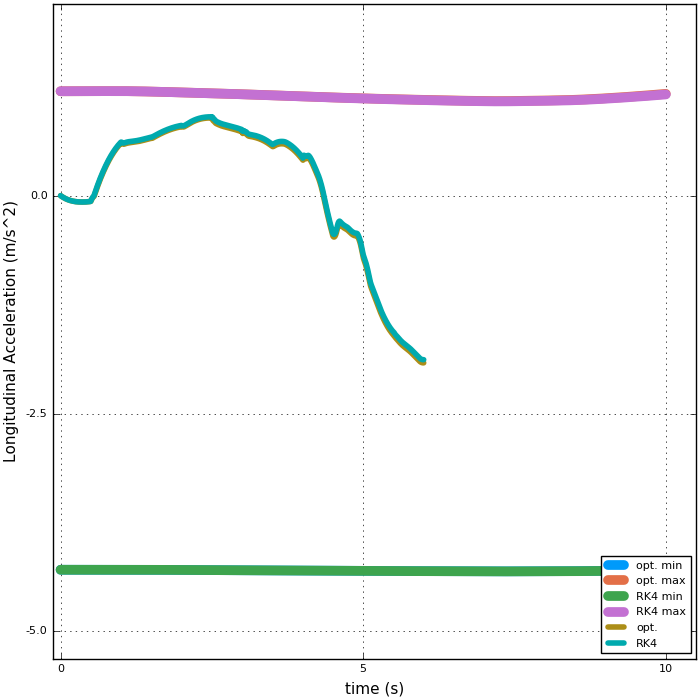
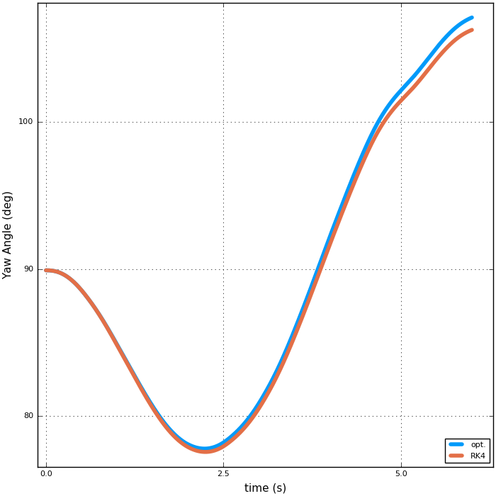
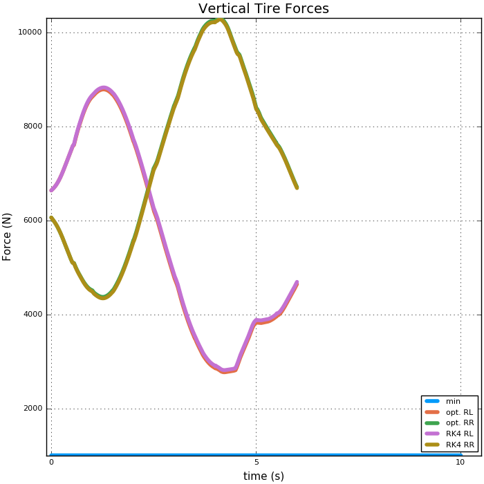

Using ``DifferentialEquations.jl`` to solve a set of ODEs
=========================================================

In this example we use two small packages along with `DifferentialEquations.jl <https://github.com/JuliaDiffEq/ParameterizedFunctions.jl>`_ that can be downloaded by typing:
::
  Pkg.clone("https://github.com/huckl3b3rry87/VehicleModels.jl")
  Pkg.clone("https://github.com/huckl3b3rry87/PrettyPlots.jl")

Then, the example can be ran by going into the examples folder and typing:
::
  include("test.jl")

This is a mock example, but it demonstrates the utility of ``DifferentialEquations.jl``.

What we are doing is passing the control signals (optimized steering rate and longitudinal jerk) for a large-sized ground vehicle to a set of differential equations that describe the vehicle dynamics.

From the optimized data, we also have all of the states so we compare the results of the two models in this case. The two models should be very close, which they are for the most part, except where the optimized steering rate and longitudinal jerk are very jumpy.

.. image:: examples/testing/position.gif

For a closer look at the end (last optimization) of the static plots, look below.

**Taking a look at the states:**

.. image:: examples/testing/main.png

**A closer look at the states and controls:**

.. image:: examples/testing/jx.png
.. image:: examples/testing/sa.png
.. image:: examples/testing/sr.png

.. image:: examples/testing/yr.png
.. image:: examples/testing/latv.png
.. image:: examples/testing/pp.png

**The tire forces are:**

.. image:: examples/testing/lt.png
